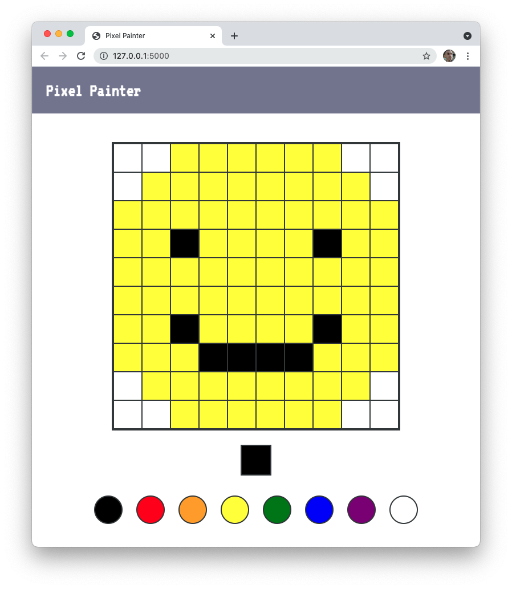

# Events Lab

Now that you know how to work with event listeners, you can build a simple pixel painter in the browser.



---

## Lab Setup

### Getting started

1. Fork and clone this repository.

1. Navigate to the cloned repository's directory on your command line. Then, run the following command:

   ```
   npm install
   ```

   This will install the libraries needed to run the tests.

1. Open up the repository in VSCode. Follow the instructions below to complete the Lab.

### Tests

To run the tests, you can run the following command from the command line. You will need to be in the root directory of your local directory.

```
npm test
```

This will open the Cypress testing window, where you can click to run an individual suite of tests or all of the tests at once.

## Instructions

To get the tests to pass for this lab, you will need to complete the following tasks. If you're unclear about any of the instructions below, remember that you can check the test file to see what exactly is being tested.

- [ ] When a color is clicked in the `#palette`, the `#current-color` element should have its background changed to that color. For example, if you click the green circle in the `#palette`, the `#current-color` element's background should change to be green.

- [ ] When you click on a `.cell`, its background should change to match the background of `#current-color`.

### Tip

Remember that you can access an elements style declarations by accessing the `.style` property on the individual element. You can also use this to set styles.

### Additional Features

Attempt to implement _at least one_ of the following features:

- [ ] Increase the number of cells without increasing the width or height of the `#canvas` element.
- [ ] Change the event listener so that instead of clicking to fill a color, you hold down your mouse.
- [ ] Create a button that, when clicked, resets all cells so that they all have a background of white.
- [ ] Create a button that, when clicked, changes all of the cells so that they match the `#current-color` element's background.

Feel free to add other fun features to build out your pixel painter!
